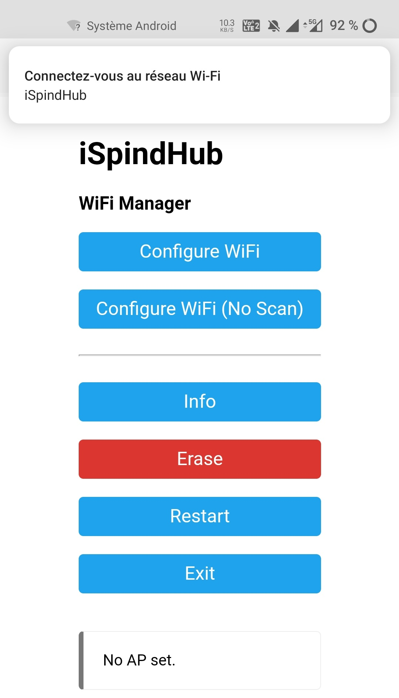

**iSpindHub Documentation**

(Loads of information is coming from info put together by [korev on the HBT Forum](https://www.homebrewtalk.com/threads/ispindle-concentrators-repeaters-bridges-hubs.693125/post-9237012) Many thanks for the time he took to put it together )

iSpindHub is a relay/repeater allowing to forward information to serveral cloud services to track your fermentation. On top of it, the screen is there to give a local display of the information coming from your iSpindels.

<!-- vscode-markdown-toc -->
* 1. [1.1. iSpindHub Setup](#iSpindHubSetup)
* 2. [1.2. iSpindHub Navigation](#iSpindHubNavigation)
	* 2.1. [ Home Screen](#HomeScreen)
	* 2.2. [ Settings](#Settings)
		* 2.2.1. [Base Settings](#BaseSettings)
	* 2.3. [ Targets](#Targets)
		* 2.3.1. [ BrewFather](#BrewFather)
* 3. [1.3. iSpindel Setup](#iSpindelSetup)

<!-- vscode-markdown-toc-config
	numbering=true
	autoSave=true
	/vscode-markdown-toc-config -->
<!-- /vscode-markdown-toc -->

# 1. All you need to know to get started with iSpindHub
- Build it
- Flash FirmWare
- Connect to Wifi and do Setup
- SetUp your iSpindel to talk to iSpindHub
- PROFIT (or something)

##  1. 1.1. iSpindHub Setup
 On first start (or as long as it is not connected to a WiFi network), the iSpindHub will broadcast a local AP (access Point) called iSpindHubConfig or iSpindHub.
 

 Connect to said WiFi then access ip 192.168.4.1 (if not offered to connect directly)
 You'll see a "WiFi Manager" page with a Configure WiFi Option
 

 Pick it
 

 Chose a WiFi Network, enter the password for it and save.
 Should be enough.
 If there is no DHCP on your network, then you'll have to set up the gateway IP, the SubNet as well as the static DNS.

Once it restarts, you should now have both an AP call iSpindHub and an iSpindHub on your network.
Ip to connect to it should be on the last line of the display 

##  2. 1.2. iSpindHub Navigation
###  2.1.  Home Screen
When you connect to the iSpindHub, you see a list of logs from iSpindels communicating (or having communicated) with the iSpindHub.

Clicking on the trash bin will delete the log file.
Clicking on the logfile name will try and download it (**==not working for the moment==**)

###  2.2.  Settings
Landing gives some explanation and presents you with 3 tabs

####  2.2.1. Base Settings

This allows to change the iSpindHub ID (hence the broadcast Access Point) as well as the Time Zone for the iSpindHub.
You need to click Update (**==and to reboot for the time being, working on it==**)

###  2.3.  Targets
==For the time being, only BrewFather is working==
####  2.3.1.  BrewFather
Easy settings. Enter your BrewFather key, enter the frequency you want the information to be pushed to BrewFather in minutes, hit Update and you're good to go.

##  3. 1.3. iSpindel Setup
- Put you iSpindel in configuration mode
- Get onto the iSpindel network
- You should see an iSpindHub (or however you renamed it) network
- Connect your iSpindel to it
  - set ssid for iSpindHub (or whatever the SSID is)
  - No Password (==Work in Progress==)
- Use the HTTP Protocol
- Token : empty
- Port : 80
- IP to use : 192.168.4.1
- Path : /ispindel

Save and you're good to go.
